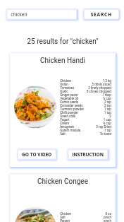
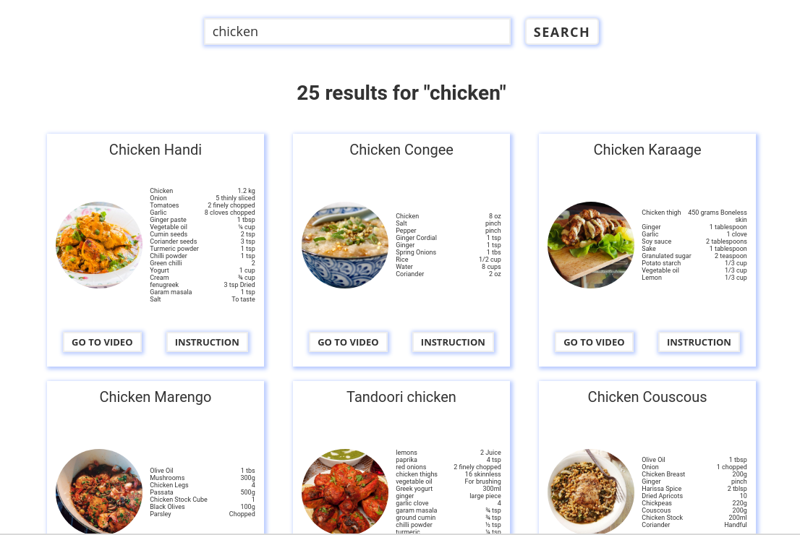
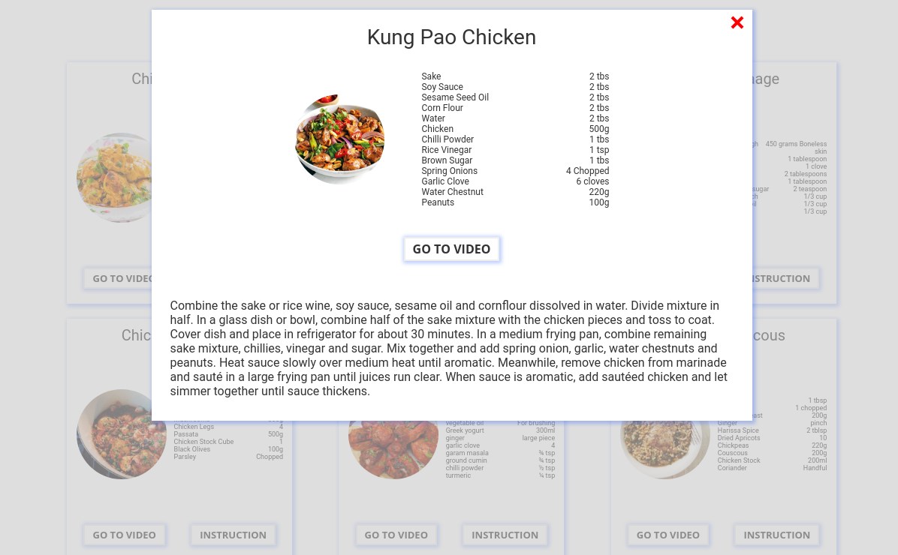

Mobile view: 

Desktop view: 

Mobile popup with instruction: 

Desktop view: 

## Available Scripts

In the project directory, you can run:

### `npm start`

Runs the app in the development mode.
Open [http://localhost:3000](http://localhost:3000) to view it in the browser.

